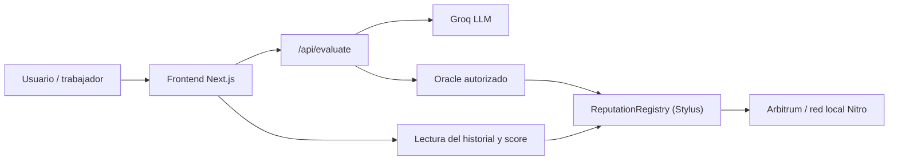

# ChambaChain

Plataforma de reputación laboral on-chain para trabajadores informales y de la economía gig en Perú.

ChambaChain convierte evidencia de trabajo real en una señal verificable, portable y confiable. En lugar de depender de reseñas aisladas en aplicaciones específicas, la reputación queda registrada en una red blockchain y se puede consultar desde cualquier interfaz compatible.

La aplicación actual está enfocada en tres puntos clave:

- conectar la wallet del trabajador,
- enviar evidencia de desempeño,
- consultar el score y el historial de atestaciones en una vista de reputación.

---

## Qué problema resuelve

Un repartidor, un gasfitero, un ayudante de obra o un freelance peruano suele construir confianza durante años, pero esa reputación queda atrapada dentro de una sola app o plataforma.

Cuando cambia de servicio, empieza de cero. ChambaChain propone un sistema donde:

- la evidencia se analiza con IA,
- un oracle autorizado registra el resultado on-chain,
- el historial queda asociado a una wallet y puede verificarse en cualquier momento.

---

## Cómo funciona hoy

La experiencia actual de la app está organizada en tres pantallas muy claras:

1. Home
   - Presenta la idea general del producto.
   - Explica que la reputación laboral puede ser verificable.
   - Muestra el wallet conectado si existe una cuenta activa.

2. Enviar evidencia
   - El usuario conecta su wallet.
   - Escribe una descripción de su actividad, reseñas, tareas, testimonios o trabajo realizado.
   - La API de la app llama a Groq para analizar la evidencia y devolver un score de 0 a 100 con una explicación.
   - Un oracle autorizado firma la transacción y registra la atestación en el contrato.

3. Mi reputación
   - Lee el score más reciente desde el contrato.
   - Muestra el historial completo de atestaciones.
   - Presenta la línea de tiempo con fechas y hash de la evidencia.

La lógica clave es que el usuario no puede asignarse a sí mismo un score: solo una address autorizada puede escribir la atestación. Eso convierte el sistema en una reputación verificable, no un auto-reconocimiento.

---

## Arquitectura del flujo



### Flujo real

- El usuario pega evidencia textual en la pantalla de evaluación.
- El backend valida que la dirección y la evidencia sean válidas.
- Se genera un hash `keccak256` de la evidencia para guardar una prueba inmutable.
- El modelo de IA devuelve un `score` y un `reasoning`.
- El oracle firma la transacción con su llave privada.
- El contrato registra:
  - worker,
  - score,
  - timestamp,
  - evidenceHash.
- La UI vuelve a consultar `getLatestScore` y `getHistory` para mostrar el estado actual.

---

## Qué se guarda on-chain

La evidencia completa no se guarda en blockchain. Lo que se registra es:

- `score`: número entero entre 0 y 100,
- `timestamp`: momento de la atestación,
- `evidenceHash`: hash de la evidencia, calculado con `keccak256`.

Esto permite verificar que el score corresponde exactamente a la evidencia evaluada sin exponer el texto completo en la cadena.

---

## Contrato inteligente

El contrato principal está en Rust usando Stylus y se llama `reputation-registry`.

Funciones principales:

- `submitAttestation(worker, score, evidenceHash)`
- `getLatestScore(worker)`
- `getHistory(worker)`
- `getHistoryLength(worker)`
- `getAttestation(worker, index)`
- `addOracle(address)`
- `removeOracle(address)`
- `owner()`
- `isOracle(address)`

La decisión de diseño es intencional: el score no lo escribe el usuario, sino un oracle autorizado. Esa restricción es la base de la confianza del sistema.

---

## Stack técnico

- Frontend: Next.js
- UI: scaffold + Tailwind/daisyUI/estilos actuales
- Wallet: RainbowKit + Wagmi
- Backend: Route handler de Next.js
- IA: Groq (modelo `llama-3.3-70b-versatile` o equivalente)
- Contrato: Rust + Stylus
- Red local: Nitro devnode
- EVM/L2: Arbitrum-compatible local devnet

---

## Requisitos previos

Necesitas lo siguiente en tu entorno:

- Node.js 20+
- Yarn 3
- Docker
- Rust
- `cargo-stylus`
- Foundry (`cast`)

Instalación base de Rust y herramientas:

```bash
curl --proto '=https' --tlsv1.2 -sSf https://sh.rustup.rs | sh
rustup default 1.91.0
rustup target add wasm32-unknown-unknown --toolchain 1.91.0
cargo install --force --locked cargo-stylus@0.10.8
curl -L https://foundry.paradigm.xyz | bash
foundryup
```

---

## Instalación del proyecto

```bash
git clone https://github.com/Paulcd/chambachain.git
cd chambachain
yarn install
```

Configura las variables del entorno del servidor:

```bash
cp packages/nextjs/.env.example packages/nextjs/.env.local
```

Completa mínimo esto:

- `GROQ_API_KEY`
- `ORACLE_PRIVATE_KEY`

El archivo de ejemplo incluye una explicación detallada de cada valor y la recomendación de uso en red local.

---

## Cómo correrlo localmente

Abre 3 terminales y ejecuta:

### 1) Levantar la red local

```bash
yarn chain
```

### 2) Desplegar el contrato

```bash
yarn deploy
```

### 3) Iniciar la app

```bash
yarn start
```

La app queda disponible en:

```text
http://localhost:3000
```

---

## Cómo se ve la data en la aplicación

La app no solo muestra un score aislado; presenta un flujo de reputación completo:

- en la pantalla de evaluación, el usuario ve el detalle de su evidencia y el resultado de la IA,
- en la pantalla de reputación, se muestra el score actual en una tarjeta principal,
- además aparece la línea de tiempo con cada atestación y su hash:
  - puntaje,
  - fecha/hora,
  - hash de la evidencia,
  - badge de la atestación más reciente.

Esto hace que la reputación sea legible, comparable y verificable sin perder el enfoque del producto.

---

## Estructura del repositorio

```text
.
├── nitro-devnode/
│   └── scripts y nodo local para Arbitrum Nitro
├── packages/
│   ├── nextjs/
│   │   ├── app/
│   │   │   ├── api/evaluate/
│   │   │   ├── evaluar/
│   │   │   ├── mi-reputacion/
│   │   │   └── page.tsx
│   │   ├── components/
│   │   ├── hooks/
│   │   └── contracts/
│   └── stylus/
│       ├── contracts/
│       ├── scripts/
│       └── test setup
├── package.json
├── README.md
└── .env.example (según proyecto)
```

---

## Seguridad

El proyecto mantiene un enfoque serio de seguridad:

- la llave del oracle se usa solo en el backend,
- la evidencia no se persiste como texto plano en la cadena,
- el contrato valida el rango del score,
- la escritura solo la puede hacer una address autorizada.

La idea es que la confianza del sistema no dependa del usuario, sino del protocolo y del oracle.

---

## Estado del proyecto

Este repositorio ya refleja la lógica de negocio y la experiencia de usuario que actualmente está funcionando:

- conexión de wallet,
- evaluación de evidencia con IA,
- registro on-chain de la reputación,
- consulta del historial y del score actual.

Se mantiene el diseño actual y se prioriza claridad, legibilidad y coherencia con la data que se está mostrando.

---

## Licencia

MIT
