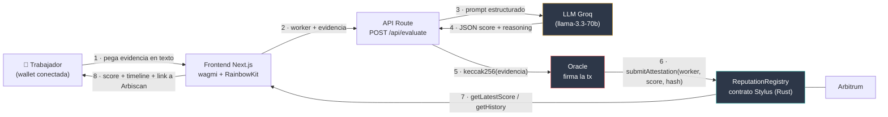

# ChambaChain

**Reputación laboral verificable para trabajadores informales y de la economía gig en Perú.**

Hackathon Ethereum Lima 2026 — track Advanced (Scaffold-Stylus + IA).

---

## El problema

Un repartidor, un gasfitero o un freelance peruano construye reputación durante años, pero esa reputación vive
encerrada dentro de cada plataforma. Si cambia de app, empieza de cero. No existe una forma de acumular una señal de
confianza que **se mueva con la persona** entre plataformas.

## La solución

ChambaChain registra **atestaciones de confianza on-chain**, generadas por un análisis de IA sobre la evidencia que el
trabajador aporta (reseñas, descripciones de trabajos hechos, testimonios de clientes).

La decisión de diseño central: **el score lo escribe un oracle autorizado, no el trabajador.**

El backend corre el análisis de IA y firma la transacción con la llave del oracle. El contrato rechaza cualquier
escritura que no venga de una address autorizada. Sin esa restricción el registro sería un cuaderno donde cada quien
se pone la nota que quiere; con ella, el contrato **es** el mecanismo de confianza.

---

## Arquitectura



**Qué sube on-chain:** el score, el timestamp y el `keccak256` de la evidencia. El texto de la evidencia **no** se
sube — el hash sirve para probar después que un score corresponde exactamente a esa evidencia y no a otra.

---

## El contrato: `ReputationRegistry`

Escrito en Rust con [Stylus](https://arbitrum.io/stylus). Un solo contrato, sin sobre-diseño.

```rust
pub struct Attestation {
    uint8   score;          // 0-100
    uint64  timestamp;
    bytes32 evidence_hash;  // hash del texto evaluado por la IA
}

pub struct ReputationRegistry {
    address owner;
    mapping(address => Attestation[]) worker_history;
    mapping(address => bool) authorized_oracles;
}
```

| Función | Quién puede llamarla | Qué hace |
| --- | --- | --- |
| `submitAttestation(worker, score, evidenceHash)` | **solo oracles autorizados** | Registra una atestación. Rechaza `score > 100`. |
| `getLatestScore(worker)` | cualquiera | Último score (0 si no tiene historial). |
| `getHistory(worker)` | cualquiera | Historial completo `(score, timestamp, evidenceHash)[]`. |
| `getHistoryLength(worker)` / `getAttestation(worker, i)` | cualquiera | Acceso indexado al historial. |
| `addOracle(a)` / `removeOracle(a)` | **solo owner** | Gestiona quién puede escribir. |
| `owner()` / `isOracle(a)` | cualquiera | Lectura de permisos. |

El constructor registra al deployer como owner **y** como primer oracle, para que el backend pueda escribir desde el
arranque.

---

## Requisitos

- Node >= 20.18 y Yarn v2+
- Docker (para el nodo Nitro local)
- Rust **1.91.0** y `cargo-stylus` **0.10.8** (versiones fijas — no uses `stylusup`, instala las versiones exactas)
- Foundry (`cast`)

```bash
curl --proto '=https' --tlsv1.2 -sSf https://sh.rustup.rs | sh
rustup default 1.91.0
rustup target add wasm32-unknown-unknown --toolchain 1.91.0
cargo install --force --locked cargo-stylus@0.10.8
curl -L https://foundry.paradigm.xyz | bash && foundryup
```

> **Windows:** Scaffold-Stylus no soporta Windows nativo. Usa WSL2 (Ubuntu) con `networkingMode=mirrored` en
> `%USERPROFILE%\.wslconfig`, de modo que el contenedor de Docker publicado en Windows sea alcanzable desde WSL.

## Instalación

```bash
git clone https://github.com/Paulcd/chambachain.git
cd chambachain
yarn install
```

Configura el frontend:

```bash
cp packages/nextjs/.env.example packages/nextjs/.env.local
```

y rellena `GROQ_API_KEY` (capa gratuita, en https://console.groq.com/keys) y `ORACLE_PRIVATE_KEY` (para la devnet local ya viene la llave de prueba documentada).

## Correrlo en local

Tres terminales:

```bash
yarn chain
```

```bash
yarn deploy
```

```bash
yarn start
```

App en <http://localhost:3000>.

### Tests del contrato

```bash
yarn stylus:test
```

### Desplegar a Arbitrum Sepolia

```bash
yarn deploy --network sepolia
```

Requiere `PRIVATE_KEY_SEPOLIA`, `ACCOUNT_ADDRESS_SEPOLIA` y `RPC_URL_SEPOLIA` en `packages/stylus/.env`.

---

## Las 3 pantallas

1. **Conectar wallet** — RainbowKit, tal cual viene del scaffold.
2. **Enviar evidencia** (`/evaluar`) — textarea + "Evaluar y registrar" → score, razonamiento de la IA y link a la tx.
3. **Mi reputación** (`/mi-reputacion`) — score actual y línea de tiempo de atestaciones leída del contrato.

---

## Despliegue

| | |
| --- | --- |
| Red | _(pendiente de deploy)_ |
| Dirección del contrato | _(pendiente de deploy)_ |
| Arbiscan | _(pendiente de deploy)_ |
| Demo | _(pendiente)_ |

---

## Estructura

```
packages/
  stylus/contracts/reputation-registry/   # el contrato en Rust
  stylus/scripts/deploy.ts                # despliegue + export del ABI al frontend
  nextjs/app/api/evaluate/route.ts        # IA + oracle (firma la tx)
  nextjs/app/evaluar/                     # pantalla 2
  nextjs/app/mi-reputacion/               # pantalla 3
```

## Seguridad

- La llave del oracle vive **solo** en variables de entorno del servidor, nunca en el cliente ni en el repo.
- `/api/evaluate` valida la address, exige un mínimo de evidencia y acota el score a 0-100 antes de enviarlo
  (el contrato también lo valida).
- La evidencia en texto plano no se persiste: solo viaja al modelo y se guarda su hash.

## Licencia

MIT
